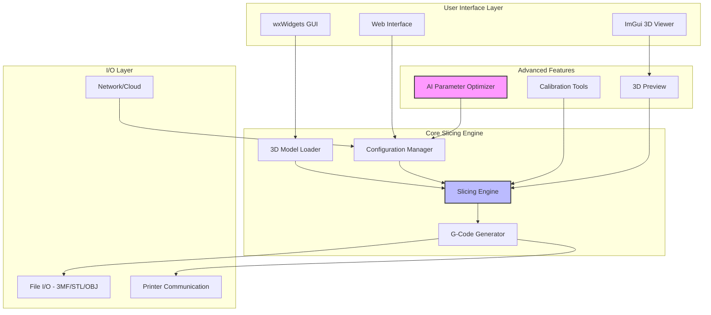
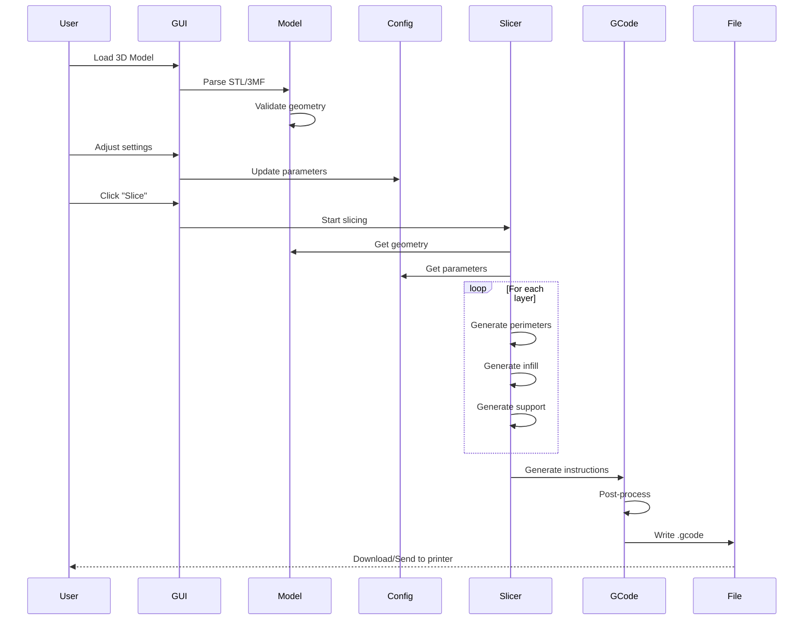
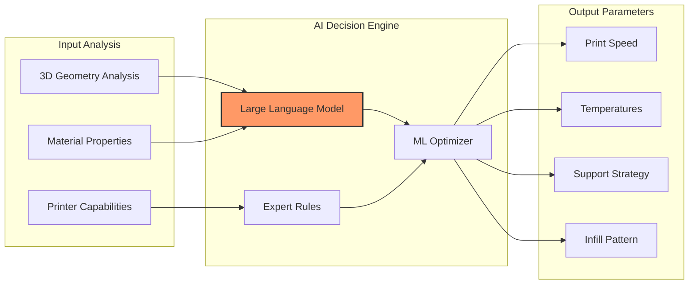
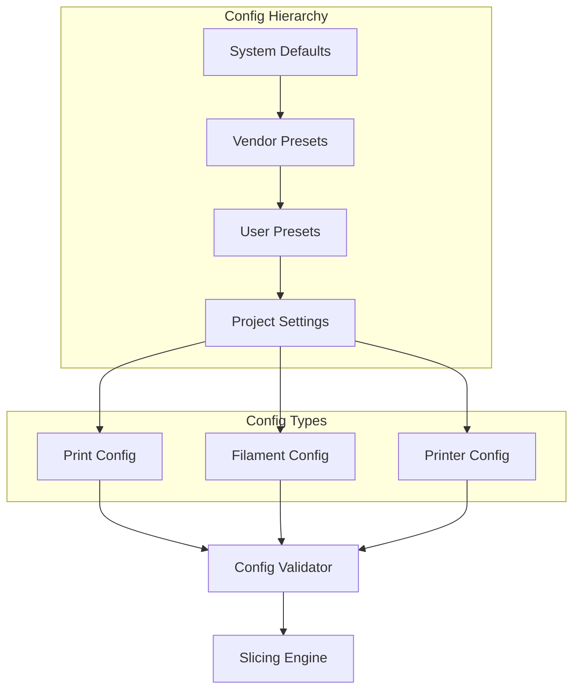
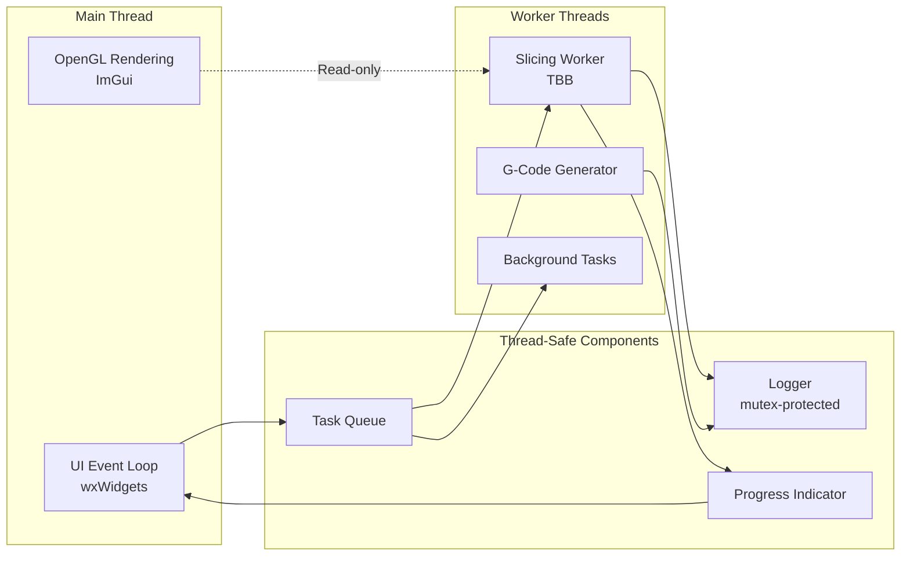
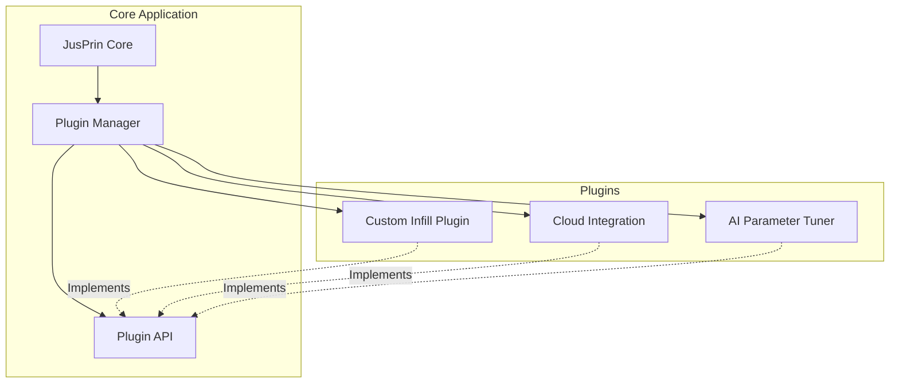
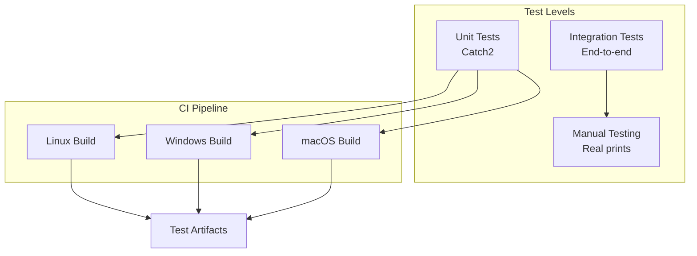

# JusPrin Architecture

## System Overview

JusPrin is an advanced 3D printing slicer built on the OrcaSlicer/PrusaSlicer codebase, providing intelligent slicing with AI-assisted parameter optimization.

---

## Component Breakdown

### 1. libslic3r (Core Library)

**Purpose**: Platform-independent slicing algorithms and data structures.

**Key Modules**:
- `Model`: 3D geometry representation
- `TriangleMesh`: Mesh processing
- `Print`: Slicing orchestration
- `GCode`: G-code generation
- `Config`: Configuration management

**Dependencies**: Boost, Eigen, OpenVDB, TBB

---

### 2. slic3r/GUI (User Interface)

**Purpose**: wxWidgets-based graphical user interface.

**Key Components**:
- `Plater`: Main 3D workspace
- `Tab`: Settings panels
- `GLCanvas3D`: OpenGL 3D viewer (uses ImGui)
- `Field`: Input validation widgets
- `ConfigWizard`: Setup assistant

**Dependencies**: wxWidgets 3.0+, OpenGL, ImGui, GLew

---

### 3. resources/web (Web Interface)

**Purpose**: Optional web-based control interface.

**Tech Stack**:
- HTML5 + TailwindCSS
- JavaScript (vanilla)
- RESTful API backend (planned)

**Status**: UI implemented, backend integration pending

---

## Data Flow - Slicing Pipeline

---

## AI Integration Points (Planned)

**Note**: AI features are documented in [`doc/AI_ARCHITECTURE.md`](file:///home/yurix/Documentos/JusPrin/doc/AI_ARCHITECTURE.md) but not yet implemented.

---

## Configuration System

**Validation**: See `src/slic3r/Utils/ValidationUtils.hpp` for safe input parsing.

---

## Threading Model

**Thread Safety**: Logger uses `std::mutex` for thread-safe logging. See `src/slic3r/Utils/Logger.hpp`.

---

## Plugin System (Future)

**Status**: Plugin system architecture defined but not implemented. See P2.5 in implementation plan.

---

## Build System

**Build Tool**: CMake 3.13+

**Key Options**:
- `BUILD_TESTS`: Enable unit tests (ON by default, P1.1)
- `SLIC3R_GUI`: Build with GUI (default ON)
- `SLIC3R_STATIC`: Static linking (platform-dependent)
- `SLIC3R_ENABLE_LTO`: Link-time optimization (P2.1)

**Dependencies Management**:
- Linux: System packages or `build_linux.sh -d`
- Windows: `build_win.bat -d`
- macOS: Homebrew + manual deps

---

## Testing Strategy

**CI Configuration**: See [`.github/workflows/ci.yml`](file:///home/yurix/Documentos/JusPrin/.github/workflows/ci.yml)

---

## File Formats

### Input Formats
- **STL**: Triangle mesh (ASCII/Binary)
- **OBJ**: Wavefront object
- **3MF**: 3D Manufacturing Format (preferred)
- **AMF**: Additive Manufacturing Format

### Output Formats
- **G-Code**: Printer instructions
- **3MF**: Project files with embedded settings

### Configuration Formats
- **INI**: Legacy config format
- **JSON**: Vendor bundle format

---

## Error Handling & Logging

**Strategy**:
1. **Input Validation**: `ValidationUtils.hpp` for safe parsing
2. **Structured Logging**: `Logger.hpp` for debugging
3. **User Feedback**: wxWidgets dialogs for errors
4. **Crash Reports**: Optional telemetry (not yet implemented)

**Error Levels**:
- `ERROR`: Critical failures
- `WARNING`: Potential issues
- `INFO`: Normal operation
- `DEBUG`: Development info

---

## Performance Considerations

**Optimization Techniques**:
- TBB for parallel slicing
- OpenVDB for efficient volume operations
- Link-Time Optimization (LTO) - P2.1
- Lazy evaluation of geometry
- Spatial acceleration structures (KD-tree, BVH)

**Profiling**:
- Built-in profiler option: `SLIC3R_PROFILE`
- PGO support planned (P3.4)

---

## Resources

- **API Documentation**: Generate with `doxygen .doxygen` (P1.5)
- **User Manual**: See `doc/` directory
- **Developer Guide**: This document
- **AI Architecture**: [`doc/AI_ARCHITECTURE.md`](file:///home/yurix/Documentos/JusPrin/doc/AI_ARCHITECTURE.md)
- **Web UI Docs**: [`resources/web/README.md`](file:///home/yurix/Documentos/JusPrin/resources/web/README.md)

---

*Last Updated: 2024 (P2.4)*
